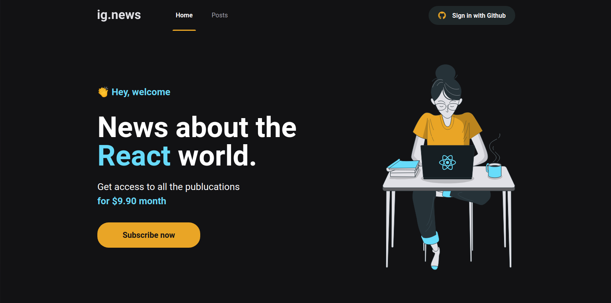

# IG News




> Aplicação desenvolvida durante Bootcamp Ignite de ReactJs da Rocketseat, esta aplicação se consistem em um Blog para devs, onde os mesmo realizam acesso a plataforma para ter acesso aos Posts.

A plataforma conta com:
* Login via GitHub;
* Opção de Preview de posts para usuários sem inscrição ativa na plataforma ;
* Prismic CMS
* Pagamentos via Stripe;
* Banco de dados NSQL - FaunaDB;
* Entre outros;

## 🚀 Tecnologias


- [NextJS](https://nextjs.org/)
- [TypeScript](https://www.typescriptlang.org/)
- [React Router DOM](https://reacttraining.com/react-router/)
- [Prismic](https://prismic.io/)
- [Stripe](https://stripe.com/)
- [FaunaDB](https://fauna.com/)
- [Github Authentication](https://docs.github.com/en/authentication)


## ☕ Usando < IG News >

Para usar IG News , siga estas etapas: </br></br>
**Clone o projeto e acesse a pasta**

```bash
$ git clone https://github.com/msalves008/ignite_rocketseat-reactjs-IgNews && cd ignews
```
**Siga os passos a baixo**
```bash
# Instalando as dependências
$ yarn install


# Iniciando o projeto
$ yarn start

```

```
Environment variables

GITHUB_ID= YOUR GITHUB_ID HERE
GITHUB_SECRET= YOUR GITHUB_SECRET HERE

FAUNADB_KEY= YOUR FAUNADB_KEY HERE

NEXT_PUBLIC_STRIPE_PUBLIC_KEY= YOUR NEXT PUBLIC STRIPE PUBLIC KEY HERE
STRIPE_SUCCESS_URL=  YOUR STRIPE SUCCESS URL HERE
STRIPE_CANCEL_URL= YOUR STRIPE CANCEL URL HERE
STRIPE_WEBHOOK_SECRET= YOUR STRIPE WEBHOOK SECRET HERE

PRISMIC_API_URL= YOUR STRIPE WEBHOOK SECRET HERE
PRISMIC_ACCESS_TOKEN= YOUR STRIPE WEBHOOK SECRET HERE

```


## 🤝 Criador


<table>
  <tr>
    <td align="center">
      <a href="#">
        <br>
        <sub>
          <b>Matheus Alves</b>
        </sub>
      </a>
    </td>   
   
  </tr>
</table>
